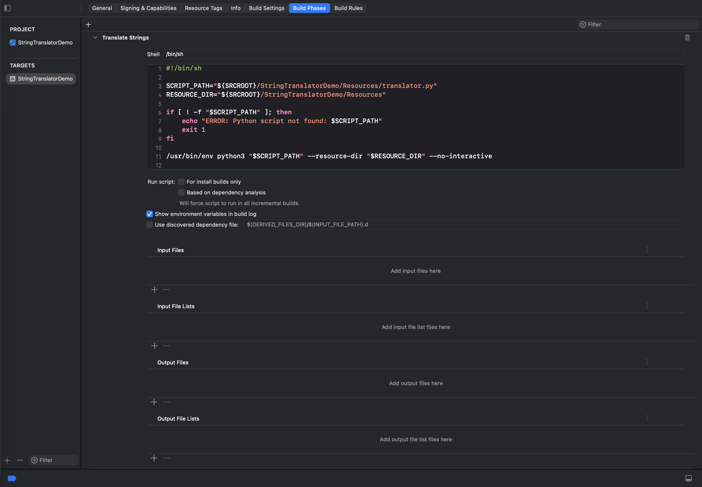
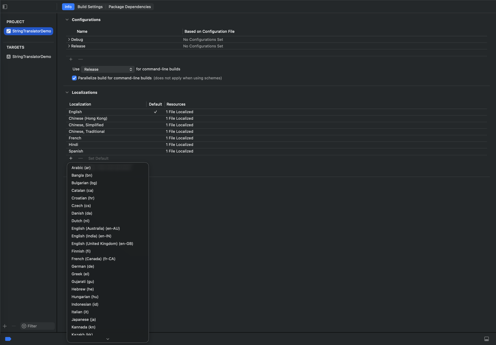
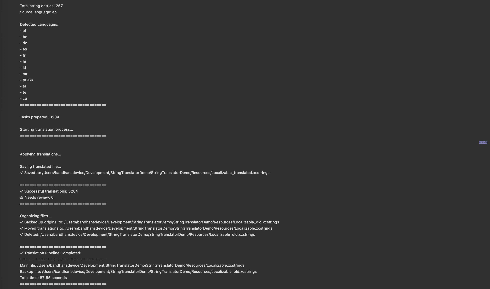

# iOS Auto-Translator for Xcode String Catalogs

Automatically translate your app's `.xcstrings` (String Catalog) files using Google Translate — integrated directly into the Xcode build pipeline. Every time you build, any untranslated strings are detected and translated automatically with no manual work required.

> **💡 Heads up**
> When writing strings in code, prefer the [`L("key")`](#approach-4--l-helper-function) function — Xcode auto-extracts it into `.xcstrings` on build, so this translator picks it up with zero manual steps.
>
> If you need to add a large number of strings at once (e.g. sweeping through a ViewModel or several files), doing it one `L("...")` call at a time gets tedious. Check out **[StringPilot](https://github.com/Bandan-Kumar-Mahto/StringPilot-Xcode-Localization-Wizard)** — a companion macOS app that scans your Swift files for string literals, lets you add keys directly into the `.xcstrings` file itself, audits your `.strings`/`.xcstrings` catalogs for missing or untranslated entries, and can batch-translate them (AI-powered or with a free api's integration and a fallback chain that almost never fails).

---

## Table of Contents

- [Features](#features)
- [Prerequisites](#prerequisites)
- [Project Setup](#project-setup)
  - [Step 1 — Place Files in Resources](#step-1--place-files-in-resources)
  - [Step 2 — Add the Build Script in Xcode](#step-2--add-the-build-script-in-xcode)
  - [Step 3 — Disable User Script Sandboxing](#step-3--disable-user-script-sandboxing)
  - [Step 4 — Add the Localization Helper Functions (Optional)](#step-4--add-the-localization-helper-functions-optional)
- [Using Localized Strings in Code](#using-localized-strings-in-code)
- [Adding New Languages](#adding-new-languages)
- [Legacy .strings File Support](#legacy-strings-file-support)
- [Performance Tuning — Thread Pool](#performance-tuning--thread-pool)
- [Best Practices](#best-practices)
- [How It Works (Under the Hood)](#how-it-works-under-the-hood)

---

## Features

- **Automatic detection** — Scans your `.xcstrings` file at build time and finds all missing or untranslated strings.
- **Google Translate powered** — Uses the free `deep-translator` library; no API key required.
- **Placeholder protection** — Safely preserves Swift string format specifiers (`%@`, `%d`, `%1$(name)@`, etc.) through translation so they are never corrupted.
- **Multi-threaded** — Translates strings in parallel for fast builds (configurable thread count).
- **Auto-install dependencies** — Installs `deep-translator` and `tqdm` automatically on first run via pip.
- **Legacy `.strings` support** — Detects and converts `.lproj/Localizable.strings` files into a `.xcstrings` catalog automatically.
- **Safe file handling** — Creates a backup (`Localizable_old.xcstrings`) before writing changes, then cleans up automatically in build mode.
- **Locale normalization** — Handles Apple-specific locale codes like `zh-Hans`, `zh-Hant`, `pt-BR`, `nb`, `he`, etc.
- **Skips untranslatable content** — Ignores emoji-only strings and languages not supported by Google Translate.

---

## Prerequisites

- macOS with Xcode 15 or later (26.5+ is recommended for .xcstrings features Specifically if the string is converting `.strings` files to `.xcstrings` files) (String Catalog / `.xcstrings` support)
- Python 3 (pre-installed on macOS)
- Internet connection (to install pip dependencies and to contact Google Translate)

No API key, no account, no paid plan needed.

---

## Project Setup

### Step 1 — Place Files in Resources

Place both files inside your app target's `Resources` folder:

```
YourApp/
└── Resources/
    ├── translator.py          ← the translation script
    └── Localizable.xcstrings  ← your String Catalog
```
---

### Step 2 — Add the Build Script in Xcode

1. In Xcode, select your project in the Project Navigator.
2. Select your **app target** → go to the **Build Phases** tab.
3. Click the **+** button at the top left → choose **New Run Script Phase**.
4. Drag the new phase **above** the `Compile Sources` phase.
5. Paste the following script into the script body:

```bash
#!/bin/sh

set -euo pipefail   # optional – fail fast on unexpected errors

if [ -n "${CI:-}" ] || [ -n "${XCODE_CLOUD:-}" ]; then
    echo "⏭️ CI detected (CI=$CI) – skipping translator script."
    exit 0
fi

# 2️⃣  Proceed only for the Debug configuration
if [ "$CONFIGURATION" = "Debug" ]; then
    echo "▶️ Running debug‑only translator script"

    SCRIPT_PATH="${SRCROOT}/StringTranslatorDemo/Resources/translator.py"
    RESOURCE_DIR="${SRCROOT}/StringTranslatorDemo/Resources"

    if [ ! -f "$SCRIPT_PATH" ]; then
        echo "❗️ ERROR: Python script not found: $SCRIPT_PATH"
        exit 1
    fi

    /usr/bin/env python3 "$SCRIPT_PATH" \
        --resource-dir "$RESOURCE_DIR" \
        --no-interactive
else
    echo "⏭️ Skipping translator – not a Debug build (CONFIGURATION=$CONFIGURATION)"
fi
```

> **Important — Update the folder name**
> Replace `YourAppName` in both occurrences with the actual name of your app's source folder (the folder that contains `Resources/`). If this path is wrong, Xcode will not find the script or the strings file and the build will fail.


---

### Step 3 — Disable User Script Sandboxing

By default, Xcode sandboxes run script phases, which blocks Python from accessing the file system and installing pip packages. You must disable this.

1. Select your project in the Project Navigator.
2. Select your **app target** → go to the **Build Settings** tab.
3. Search for **"User Script Sandboxing"**.
4. Set the value to **No**.


---

That's it. Once these three steps are complete, build your project (`Cmd + B`). The script will run automatically. Any string in your catalog that is missing a translation will be translated and written back to `Localizable.xcstrings`.

---

### Step 4 — Add the Localization Helper Functions (Optional)

Everything above makes the *translation build script* work. This step is separate and optional — it only matters if you want to use the convenience functions shown in [Using Localized Strings in Code](#using-localized-strings-in-code), such as `L("key")`, `"key".localized`, `"key".dynamicLocalized`, `LanguageManager`, or `AppStrings`.

**These functions are not part of Swift, SwiftUI, or Foundation.** They are custom code defined in this project at [StringTranslatorDemo/Extensions/Strings+Extensions.swift](StringTranslatorDemo/Extensions/Strings+Extensions.swift). If you only copy `translator.py` into your own project, calling `L("Cancel")` will fail to compile — the function doesn't exist there yet.

You don't need all of them — each one below is independent, so only copy the piece(s) you're actually going to use into a Swift file in your app target (e.g. `Strings+Extensions.swift`). All snippets need `import Foundation` at the top of the file.

> If you don't need any of these conveniences, skip this step entirely and just use SwiftUI's `Text("key")`, `String(localized: "key")`, or `NSLocalizedString("key", comment: "")` — all built into Foundation/SwiftUI with zero extra setup.

**`.localized`** — a quick property for UIKit code, referenced in the [quick reference table](#quick-reference). Simple, but ❌ **not** auto-extracted by Xcode — the key must already exist in `.xcstrings` (e.g. added via `L()` or `AppStrings` elsewhere).

```swift
extension String {
    var localized: String {
        NSLocalizedString(self, comment: "")
    }
}
```

**`L()`** — needed for [Approach 4](#approach-4--l-helper-function). The recommended free function for non-SwiftUI code. ✅ Xcode 15+ auto-extracts string literals passed to it (parameter type is `LocalizedStringResource`), and it supports interpolation: `L("Hello \(name)")`.

```swift
@inline(__always)
func L(_ resource: LocalizedStringResource) -> String {
    String(localized: resource)
}
```

**`AppStrings`** — needed for [Approach 5](#approach-5--appstrings-enum-type-safe-no-typos). Type-safe, autocomplete-friendly key definitions. ✅ Each `static let` line is auto-extracted by Xcode. Add your own keys as needed — these two are just examples.

```swift
enum AppStrings {
    static let cancel: LocalizedStringResource = "Cancel"
    static let back: LocalizedStringResource   = "Back"
}
```

**`LanguageManager` + `.dynamicLocalized`** — needed together for [Approach 6](#approach-6--languagemanager-dynamic-in-app-language-switching) (runtime in-app language switching, without the user going to iPhone Settings). ❌ `.dynamicLocalized` is **not** auto-extracted — the key must already exist in `.xcstrings`. Note: SwiftUI `Text()` ignores `LanguageManager` and always uses the system language.

```swift
final class LanguageManager {

    static let shared = LanguageManager()

    private init() {}

    var currentLanguage: String {
        get {
            UserDefaults.standard.string(forKey: "SelectedLanguage")
                ?? Locale.current.language.languageCode?.identifier
                ?? "en"
        }
        set {
            UserDefaults.standard.set(newValue, forKey: "SelectedLanguage")
        }
    }

    func localizedString(for key: String, tableName: String? = nil) -> String {
        guard
            let path = Bundle.main.path(forResource: currentLanguage, ofType: "lproj"),
            let bundle = Bundle(path: path)
        else {
            return NSLocalizedString(key, tableName: tableName, comment: "")
        }
        return NSLocalizedString(key, tableName: tableName, bundle: bundle, comment: "")
    }
}

extension String {
    var dynamicLocalized: String {
        LanguageManager.shared.localizedString(for: self)
    }
}
```

---

## Using Localized Strings in Code

Once your strings are in `.xcstrings` and auto-translated by the build script, you need to reference them in Swift. The approaches below differ in syntax and — critically — whether Xcode **automatically extracts** new keys into `.xcstrings` when you build.

### How extraction works

Xcode scans your source files at build time and adds any new string keys it finds into `Localizable.xcstrings`. It only recognises specific APIs. If you use an unrecognised pattern, the key is not added automatically — you must add it manually, or use a recognised API elsewhere in your project.

### Quick reference

| How you write it | ✅ / ❌ Auto-extracted | Requires [Step 4](#step-4--add-the-localization-helper-functions-optional)? | Notes |
|---|---|---|---|
| `Text("key")` | ✅ Yes | No — built in | SwiftUI only |
| `String(localized: "key")` | ✅ Yes | No — built in | Anywhere — modern API (iOS 16+) |
| `NSLocalizedString("key", comment: "")` | ✅ Yes | No — built in | Anywhere — classic API |
| `L("key")` | ✅ Yes (Xcode 15+) | **Yes** | Custom wrapper — `LocalizedStringResource` param |
| `static let x: LocalizedStringResource = "key"` (`AppStrings`) | ✅ Yes | **Yes** | From the definition site |
| `"key".localized` | ❌ No | **Yes** | Xcode can't resolve `self` statically |
| `"key".dynamicLocalized` | ❌ No | **Yes** | Plain `String` param, invisible to extractor |

---

### Approach 1 — SwiftUI `Text` (simplest, recommended for SwiftUI)

`Text` takes `LocalizedStringKey`. Xcode extracts string literals automatically.

```swift
Text("Cancel")       // ✅ extracted and localised
Text("Save Changes") // ✅ extracted and localised
```

Use `Text(verbatim:)` when you want a string displayed exactly as written — it is **not** localised and **not** extracted.

```swift
Text(verbatim: "Version 1.0.0")  // ❌ not extracted, shown as-is
```

---

### Approach 2 — `String(localized:)` (recommended for non-SwiftUI)

The modern Foundation API, available anywhere a plain `String` is needed.

```swift
let title  = String(localized: "Cancel")        // ✅ extracted
label.text = String(localized: "Save Changes")  // ✅ extracted
```

---

### Approach 3 — `NSLocalizedString` (classic, UIKit)

The traditional API supported since iOS 2. Always extracted by Xcode.

```swift
label.text = NSLocalizedString("Cancel", comment: "Dismiss alert") // ✅ extracted
```

> Prefer `String(localized:)` for new code — it is more concise and integrates better with `.xcstrings`.

---

### Approach 4 — `L()` helper function

A thin wrapper around `String(localized:)`. Because its parameter type is `LocalizedStringResource`, Xcode 15+ extracts string literals you pass to it. Also supports interpolation.

**Implementation:**

Add this helper function in a Swift file (e.g. `Strings+Extensions.swift`):
```swift
import Foundation

@inline(__always)
func L(_ resource: LocalizedStringResource) -> String {
    String(localized: resource)
}
```

**Usage:**
```swift
label.text = L("Cancel")          // ✅ extracted
label.text = L("Hello \(name)")   // ✅ extracted (interpolation supported)
```


---

### Approach 5 — `AppStrings` enum (type-safe, no typos)

> Requires [Step 4](#step-4--add-the-localization-helper-functions-optional) — copy `Strings+Extensions.swift` into your project first (or define your own equivalent enum).

All keys are defined as `static let` properties of type `LocalizedStringResource`. The **definition** is where extraction happens. Usage via property gives you autocomplete and compile-time checking.

```swift
enum AppStrings {
    static let cancel: LocalizedStringResource = "Cancel"  // ✅ key extracted here
    static let back: LocalizedStringResource   = "Back"    // ✅ key extracted here
}

// SwiftUI
Text(AppStrings.cancel)                        // uses pre-extracted key

// UIKit
label.text = String(localized: AppStrings.cancel)
```

---

### Approach 6 — `LanguageManager` (dynamic in-app language switching)

> Requires [Step 4](#step-4--add-the-localization-helper-functions-optional) — copy `Strings+Extensions.swift` into your project first.

Lets users switch language inside the app at runtime without going to iPhone Settings. It works with `.xcstrings` — Xcode compiles `.xcstrings` into `en.lproj/Localizable.strings`, `fr.lproj/Localizable.strings`, etc. inside the app bundle, so the manual bundle lookup succeeds.

```swift
LanguageManager.shared.currentLanguage = "fr"  // switch to French at runtime
label.text = "Cancel".dynamicLocalized          // ❌ key not extracted — must exist already
```

Two important caveats:

1. **Keys are not extracted** — `.dynamicLocalized` passes a plain `String`, which Xcode's extractor cannot see. Every key used with this approach must already exist in `.xcstrings` (added manually or via a recognised API used elsewhere).
2. **SwiftUI `Text()` ignores `LanguageManager`** — it always reads the system language. You must call `.dynamicLocalized` or `LanguageManager.shared.localizedString(for:)` explicitly to get the runtime-switched value.

---

### What "not extracted" means in practice

If a key is **not** extracted, it simply means Xcode won't add it to `.xcstrings` automatically. The runtime lookup still works as long as the key is already in the file. A common pattern is to define all keys via `AppStrings` or `String(localized:)` (so they get extracted and translated by the build script), then reference them via `.localized` or `.dynamicLocalized` where the simpler syntax is convenient.

---

## Adding New Languages

> **Do not add new languages directly from the String Catalog editor.**

When you add a language directly inside the `.xcstrings` file editor in Xcode, the strings for the new language are created without a default value. The translation script cannot detect that a new language was added because there is no value to act on — the entries appear empty rather than needing translation.

**The correct way to add a new language:**

1. In Xcode, select your **project** (not the target) in the Project Navigator.
2. Go to the **Info** tab.
3. Under **Localizations**, click the **+** button.
4. Select the language you want to add.
5. When prompted, choose **English** as the base for the translation.
6. Xcode will add the language and populate the String Catalog with untranslated entries that have English as the source value.
7. Build the project — the script will automatically translate all new entries.




---

## Legacy `.strings` File Support

If your project uses the older `.lproj/Localizable.strings` format instead of a String Catalog, the script handles this automatically:

1. The script scans the `Resources` folder for `.lproj` directories.
2. It reads all `Localizable.strings` files, deduplicates entries, and cleans up formatting.
3. It generates a new `Localizable.xcstrings` file at the same path.
4. Translation then proceeds as normal from the generated catalog.

> **Important** — After the script generates the `Localizable.xcstrings` file, you must manually **drag and drop the file into your Xcode project** in the Project Navigator so Xcode registers the file reference. The file is created on disk but Xcode will not pick it up automatically.

---

## Performance Tuning — Thread Pool

The script translates strings in parallel using a thread pool. By default, `MAX_THREADS = 20`.

When a large number of strings need to be translated at once (roughly 1000 or more), the Google Translate API may rate-limit requests and some translations may silently fail or return empty values.
I have tested more than 3000 strings getting translated at once without any issue. But it's mentioned just to be at a safe side

**When to reduce the thread count:**

- You are adding multiple new languages to the existing app with a large string catalog.
- You are setting up a brand new project with many strings and multiple languages added at the same time.

**How to reduce the thread count:**

Open `translator.py` and change the `MAX_THREADS` value near the top of the file:

```python
# Number of parallel translation threads
MAX_THREADS = 20   # default — change to 15 or 10 for large batches
```

Setting it to `15` or `10` slows down translation but ensures the API is not overwhelmed and all strings complete successfully.

Once the initial large batch is translated, you can set it back to `20` for faster incremental builds.


---

## Best Practices

**Add languages before adding strings (new projects)**

When starting a new project, add all the languages you plan to support first, before you begin adding strings to your catalog. This way, each new string is picked up during the build that adds it — the script only has to translate a small batch at a time rather than all strings at once when a language is added later.

If you add many languages after a large string catalog already exists, the script will need to translate every string into every new language in a single build, which can result in thousands of translation tasks at once.

**Incremental builds are fast**

After the initial translation, each build only processes strings that have no translation yet. Adding a few new strings between builds translates quickly even at the default thread count.

**Internet access required at build time**

The script contacts Google Translate over the network. Builds on machines without internet access (such as some CI environments) will skip translation. The build will still succeed — untranslated strings simply remain untranslated.

---

## How It Works (Under the Hood)

You don't need to read this to use the tool — it's here for anyone curious about what the build script is actually doing.

```
Xcode Build  →  Run Script Phase  →  translator.py runs
                                          ↓
                              Reads Localizable.xcstrings
                                          ↓
                         Finds strings with missing translations
                                          ↓
                         Translates via Google Translate (parallel)
                                          ↓
                         Writes updated Localizable.xcstrings
                                          ↓
                              Xcode picks up updated file
```

The script only processes strings that do not yet have a translation (state is not `"translated"`). Strings that are already translated are left untouched, keeping build times fast after the initial run.
