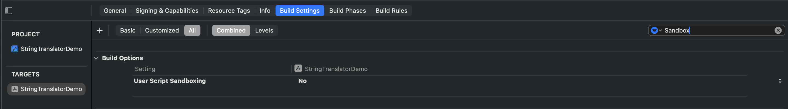
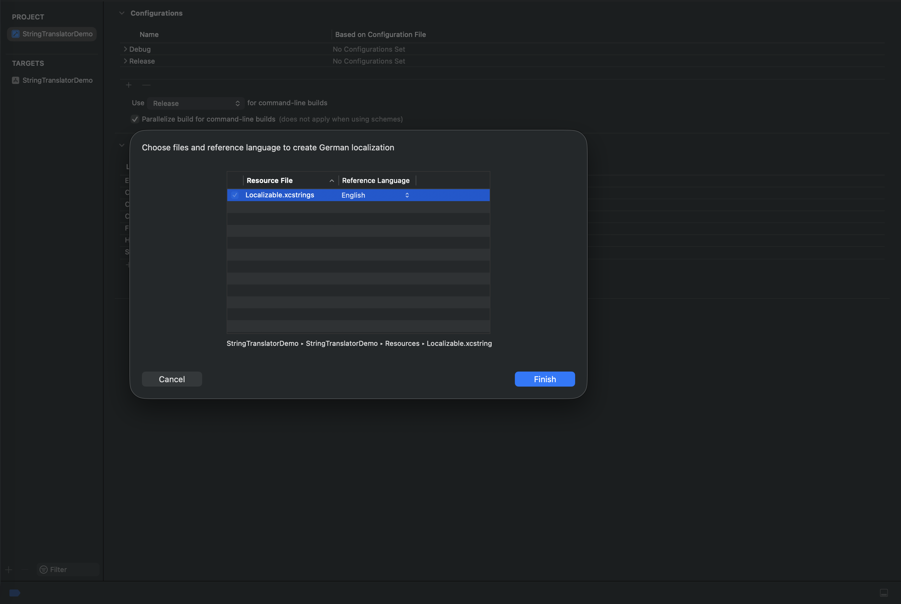

# iOS Auto-Translator for Xcode String Catalogs

Automatically translate your app's `.xcstrings` (String Catalog) files using Google Translate — integrated directly into the Xcode build pipeline. Every time you build, any untranslated strings are detected and translated automatically with no manual work required.

---

## Table of Contents

- [Features](#features)
- [How It Works](#how-it-works)
- [Prerequisites](#prerequisites)
- [Project Setup](#project-setup)
  - [Step 1 — Place Files in Resources](#step-1--place-files-in-resources)
  - [Step 2 — Add the Build Script in Xcode](#step-2--add-the-build-script-in-xcode)
  - [Step 3 — Disable User Script Sandboxing](#step-3--disable-user-script-sandboxing)
- [Adding New Languages](#adding-new-languages)
- [Legacy .strings File Support](#legacy-strings-file-support)
- [Performance Tuning — Thread Pool](#performance-tuning--thread-pool)
- [Best Practices](#best-practices)
- [Adding Images to This README](#adding-images-to-this-readme)

---

## Features

- **Automatic detection** — Scans your `.xcstrings` file at build time and finds all missing or untranslated strings.
- **Google Translate powered** — Uses the free `deep-translator` library; no API key required.
- **Placeholder protection** — Safely preserves Swift string format specifiers (`%@`, `%d`, `%1$(name)@`, etc.) through translation so they are never corrupted.
- **Multi-threaded** — Translates strings in parallel for fast builds (configurable thread count).
- **Auto-install dependencies** — Installs `deep-translator` and `tqdm` automatically on first run via pip.
- **Legacy `.strings` support** — Detects and converts `.lproj/Localizable.strings` files into a `.xcstrings` catalog automatically.
- **Safe file handling** — Creates a backup (`Localizable_old.xcstrings`) before writing changes, then cleans up automatically in build mode.
- **Locale normalization** — Handles Apple-specific locale codes like `zh-Hans`, `zh-Hant`, `pt-BR`, `nb`, `he`, etc.
- **Skips untranslatable content** — Ignores emoji-only strings and languages not supported by Google Translate.

---

## How It Works

```
Xcode Build  →  Run Script Phase  →  translator.py runs
                                          ↓
                              Reads Localizable.xcstrings
                                          ↓
                         Finds strings with missing translations
                                          ↓
                         Translates via Google Translate (parallel)
                                          ↓
                         Writes updated Localizable.xcstrings
                                          ↓
                              Xcode picks up updated file
```

The script only processes strings that do not yet have a translation (state is not `"translated"`). Strings that are already translated are left untouched, keeping build times fast after the initial run.

---

## Prerequisites

- macOS with Xcode 15 or later (26.5+ is recommended for .xcstrings features Specifically if the string is converting `.strings` files to `.xcstrings` files) (String Catalog / `.xcstrings` support)
- Python 3 (pre-installed on macOS)
- Internet connection (to install pip dependencies and to contact Google Translate)

No API key, no account, no paid plan needed.

---

## Project Setup

### Step 1 — Place Files in Resources

Place both files inside your app target's `Resources` folder:

```
YourApp/
└── Resources/
    ├── translator.py          ← the translation script
    └── Localizable.xcstrings  ← your String Catalog
```
---

### Step 2 — Add the Build Script in Xcode

1. In Xcode, select your project in the Project Navigator.
2. Select your **app target** → go to the **Build Phases** tab.
3. Click the **+** button at the top left → choose **New Run Script Phase**.
4. Drag the new phase **above** the `Compile Sources` phase.
5. Paste the following script into the script body:

```bash
#!/bin/sh

SCRIPT_PATH="${SRCROOT}/YourAppName/Resources/translator.py"
RESOURCE_DIR="${SRCROOT}/YourAppName/Resources"

if [ ! -f "$SCRIPT_PATH" ]; then
    echo "ERROR: Python script not found: $SCRIPT_PATH"
    exit 1
fi

/usr/bin/env python3 "$SCRIPT_PATH" --resource-dir "$RESOURCE_DIR" --no-interactive
```

> **Important — Update the folder name**
> Replace `YourAppName` in both occurrences with the actual name of your app's source folder (the folder that contains `Resources/`). If this path is wrong, Xcode will not find the script or the strings file and the build will fail.


---

### Step 3 — Disable User Script Sandboxing

By default, Xcode sandboxes run script phases, which blocks Python from accessing the file system and installing pip packages. You must disable this.

1. Select your project in the Project Navigator.
2. Select your **app target** → go to the **Build Settings** tab.
3. Search for **"User Script Sandboxing"**.
4. Set the value to **No**.



---

That's it. Once these three steps are complete, build your project (`Cmd + B`). The script will run automatically. Any string in your catalog that is missing a translation will be translated and written back to `Localizable.xcstrings`.

---

## Adding New Languages

> **Do not add new languages directly from the String Catalog editor.**

When you add a language directly inside the `.xcstrings` file editor in Xcode, the strings for the new language are created without a default value. The translation script cannot detect that a new language was added because there is no value to act on — the entries appear empty rather than needing translation.

**The correct way to add a new language:**

1. In Xcode, select your **project** (not the target) in the Project Navigator.
2. Go to the **Info** tab.
3. Under **Localizations**, click the **+** button.
4. Select the language you want to add.
5. When prompted, choose **English** as the base for the translation.
6. Xcode will add the language and populate the String Catalog with untranslated entries that have English as the source value.
7. Build the project — the script will automatically translate all new entries.



---

## Legacy `.strings` File Support

If your project uses the older `.lproj/Localizable.strings` format instead of a String Catalog, the script handles this automatically:

1. The script scans the `Resources` folder for `.lproj` directories.
2. It reads all `Localizable.strings` files, deduplicates entries, and cleans up formatting.
3. It generates a new `Localizable.xcstrings` file at the same path.
4. Translation then proceeds as normal from the generated catalog.

> **Important** — After the script generates the `Localizable.xcstrings` file, you must manually **drag and drop the file into your Xcode project** in the Project Navigator so Xcode registers the file reference. The file is created on disk but Xcode will not pick it up automatically.

---

## Performance Tuning — Thread Pool

The script translates strings in parallel using a thread pool. By default, `MAX_THREADS = 20`.

When a large number of strings need to be translated at once (roughly 300 or more), the Google Translate API may rate-limit requests and some translations may silently fail or return empty values.

**When to reduce the thread count:**

- You are adding one or more new languages to an existing app with a large string catalog.
- You are setting up a brand new project with many strings and multiple languages added at the same time.
- You notice some translations come back empty or incorrect after a build.

**How to reduce the thread count:**

Open `translator.py` and change the `MAX_THREADS` value near the top of the file:

```python
# Number of parallel translation threads
MAX_THREADS = 20   # default — change to 10 or 5 for large batches
```

Setting it to `10` or `5` slows down translation but ensures the API is not overwhelmed and all strings complete successfully.

Once the initial large batch is translated, you can set it back to `20` for faster incremental builds.

---

## Best Practices

**Add languages before adding strings (new projects)**

When starting a new project, add all the languages you plan to support first, before you begin adding strings to your catalog. This way, each new string is picked up during the build that adds it — the script only has to translate a small batch at a time rather than all strings at once when a language is added later.

If you add many languages after a large string catalog already exists, the script will need to translate every string into every new language in a single build, which can result in thousands of translation tasks at once.

**Incremental builds are fast**

After the initial translation, each build only processes strings that have no translation yet. Adding a few new strings between builds translates quickly even at the default thread count.

**Internet access required at build time**

The script contacts Google Translate over the network. Builds on machines without internet access (such as some CI environments) will skip translation. The build will still succeed — untranslated strings simply remain untranslated.

---